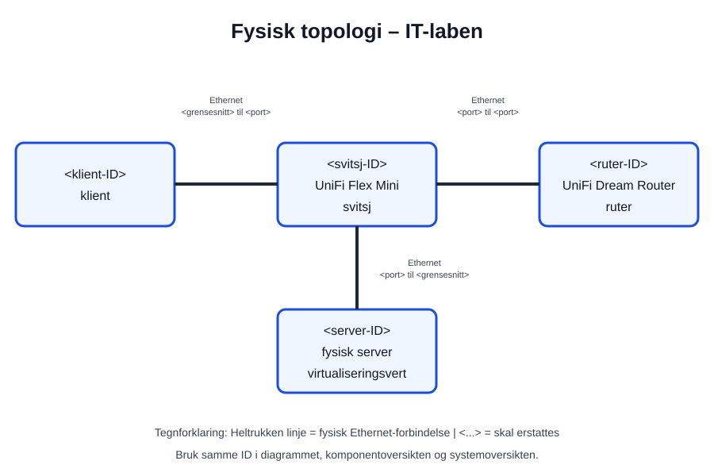
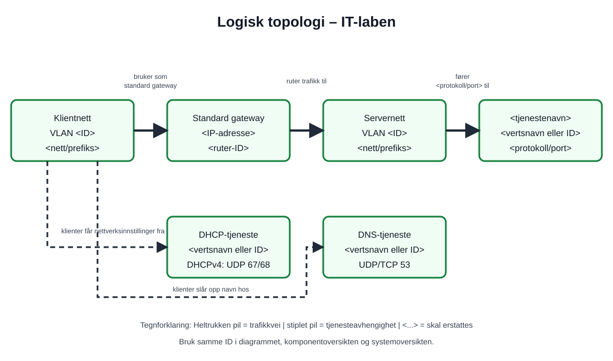

# Systemoversikt
*system overview*

Denne siden beskriver systemets **arkitektur**: komponentene, rollene, forbindelsene og avhengighetene som utgjør helheten.

**Infrastrukturen** er det tekniske grunnlaget som beskrives. Diagrammene viser systemets fysiske og logiske **topologi**.

Systemgrensen er **hele IT-laben**. Begynn forklaringen ved egen stasjon og følg forbindelsene videre til den delte infrastrukturen, tjenestene, serverne og de virtuelle ressursene.

Den skal ikke kopiere hele komponentoversikten. Bruk lenker til detaljene.

## 1. Beskriv systemet

Beskriv kort:

- hva systemet er
- hva det brukes til
- hvem som bruker det

## 2. Avgrensning

Regn hele den avtalte IT-laben som systemet. Ta med stasjonene, felles nettverksutstyr, aktuelle nett og VLAN, DHCP, DNS, avtalte tjenester, servere, hypervisorer og virtuelle maskiner.

Beskriv kort hvor grensen mot skolens øvrige nettverk og tjenester går. Ikke dokumenter systemer du ikke har fått tilgang til eller beskjed om å undersøke.

## 3. Fysisk infrastruktur

Beskriv kort de viktigste fysiske delene.

Start med klienten og kablingen ved egen stasjon. Følg den fysiske forbindelsen videre gjennom IT-laben, og utvid diagrammet etter hvert som opplysningene blir observert eller bekreftet. Merk enhetene og forbindelsene etter [standarden for diagrametiketter](../../ressurser/diagrametiketter.md#fysisk-topologi).

Se [eksempelet som skiller fysisk og logisk topologi](../../ressurser/eksempler.md#diagrammer) hvis du er usikker på hva diagrammet skal vise.

Eksempler:

- klienter
- servere
- nettverkskort
- svitsjer
- rutere
- kabling

Rediger [fysisk topologi](diagrammer/fysisk-topologi.drawio), eksporter den som SVG og kontroller forhåndsvisningen:



Se også [komponentoversikten](../komponentoversikt.md) for detaljer.

## 4. Logisk struktur

Beskriv hvordan systemet er organisert logisk.

Start med nettverksverdiene til klienten ved egen stasjon. Følg deretter nett, VLAN, standard gateway og tjenester videre gjennom hele IT-laben. Merk nettverk, gateway, tjenester og relasjoner etter [standarden for diagrametiketter](../../ressurser/diagrametiketter.md#logisk-topologi).

Eksempler:

- IP-nett
- standard gateway
- VLAN
- klient- og serverroller
- nettverkstjenester
- virtuelle maskiner

Forklar én forbindelse ved å følge:

**Ethernet/MAC -> ARP -> IP/subnett -> standard gateway -> DHCP -> DNS -> tjeneste**

Bruk [nettverkskjeden](../../ressurser/nettverkskjeden.md), [IP og subnett](../../ressurser/ip-og-subnett.md) og [nettverkskommandoene](../../ressurser/nettverkskommandoer.md) som støtte.

Rediger [logisk topologi](diagrammer/logisk-topologi.drawio), eksporter den som SVG og kontroller forhåndsvisningen:



## 5. Viktige relasjoner og avhengigheter

Beskriv de viktigste sammenhengene.

Eksempler:

```text
klient -> svitsj -> standard gateway -> annet nettverk

klient -> DNS -> tjeneste

tjeneste -> operativsystem -> VM -> hypervisor -> fysisk server
```

Forklar hvorfor avhengighetene er viktige.

## 6. Videre dokumentasjon

- [Komponentoversikt](../komponentoversikt.md)
- [Problemer og løsninger](../feilsoking.md)
- [Egen kildeliste](../kildeliste.md)
- [Velg riktig kilde](../../ressurser/kilder.md)
- [Finn virtuell og fysisk infrastruktur i Proxmox VE](../../ressurser/proxmox-ve.md)
- [Følg stasjonen i UniFi Network](../../ressurser/unifi-network.md)
